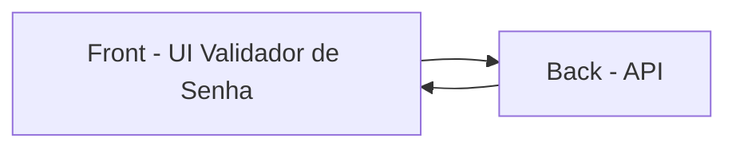

# APP: ValidationUsingAPI

Aplicação Angular, para validação de senha via API, contruído como um projeto frontend Angular singular (sem micro frontend). Segue uma arquitetura em camadas com princípios de Orientação a Objetos, utilizando serviços, classes tipadas e SOLID principles, mas também incorpora programação reativa com RxJS.

## Descrição

Organizado para facilitar manutenção e evolução:

- Camada de Apresentação: páginas e layout para composição da interface;
- Camada de Lógica de Negócio: serviços para chamada de API e regras de validação;
- Camada de Compartilhado: para controles reutilizaveis e regras de validação;
- Camada de Infra: configurações que definem o sistema e os ambientes.
- Camada de Testes: unitários e end-to-end para validar comportamento da aplicação.

Sistema pequeno de uma única entidade e sem relacionamentos, mas possui validação de formulário com regras customizadas.

Estrutura principal da aplicação:

- Projeto Angular em `ValidationUsingAPI/`;
- Codigo-fonte em `ValidationUsingAPI/src/app/`;
- Testes e2e em `ValidationUsingAPI/cypress/`.

## Como rodar a aplicação

### 1) Pre-requisitos

- Node.js instalado;
- Angular CLI disponivel.

### 2) Instalar dependencias

No terminal, a partir da raiz do repositorio:

```bash
cd ValidationUsingAPI
npm install
```

### 3) Servidor de desenvolvimento

Para iniciar o servidor local:

```bash
ng serve
```

Com o servidor ativo, acesse:

`http://localhost:4200/`

A aplicação recarrega automaticamente ao salvar alteracoes nos arquivos.

### 4) Building

Para gerar o build da aplicação:

```bash
ng build
```

Os artefatos sao gerados em `dist/`.

### 5) Rodando os testes

Para executar os testes unitarios:

```bash
ng test
```

### 6) Rodando testes End to End

Para executar os testes e2e:

```bash
ng e2e
```

## Recursos adicionais

Para mais detalhes sobre comandos do Angular CLI:

https://angular.dev/tools/cli


## Gráfico da Arquitetura de comunicação


## Arquitetura Física

📦src

 ┣ 📂app

 ┃ ┣ 📂layout

 ┃ ┃ ┗ 📂master-layout

 ┃ ┃ ┃ ┣ 📜master-layout.html

 ┃ ┃ ┃ ┣ 📜master-layout.scss

 ┃ ┃ ┃ ┣ 📜master-layout.spec.ts

 ┃ ┃ ┃ ┗ 📜master-layout.ts

 ┃ ┣ 📂Pages

 ┃ ┃ ┗ 📂validation-form

 ┃ ┃ ┃ ┣ 📜validation-form.html

 ┃ ┃ ┃ ┣ 📜validation-form.scss

 ┃ ┃ ┃ ┣ 📜validation-form.spec.ts

 ┃ ┃ ┃ ┗ 📜validation-form.ts

 ┃ ┣ 📂services

 ┃ ┃ ┣ 📂base

 ┃ ┃ ┃ ┣ 📜api-service.spec.ts

 ┃ ┃ ┃ ┣ 📜api-service.ts

 ┃ ┃ ┃ ┗ 📜api-service.types.ts

 ┃ ┃ ┣ 📂password-validation

 ┃ ┃ ┃ ┣ 📜password-validation.spec.ts

 ┃ ┃ ┃ ┣ 📜password-validation.ts

 ┃ ┃ ┃ ┗ 📜validation-form.types.ts

 ┃ ┃ ┗ 📂ui

 ┃ ┃ ┃ ┣ 📜ui-controls.spec.ts

 ┃ ┃ ┃ ┣ 📜ui-controls.ts

 ┃ ┃ ┃ ┗ 📜ui.types.ts

 ┃ ┣ 📂shared

 ┃ ┃ ┣ 📂control-dark-light

 ┃ ┃ ┃ ┣ 📜control-dark-light.html

 ┃ ┃ ┃ ┣ 📜control-dark-light.scss

 ┃ ┃ ┃ ┣ 📜control-dark-light.spec.ts

 ┃ ┃ ┃ ┗ 📜control-dark-light.ts

 ┃ ┃ ┣ 📂control-hue

 ┃ ┃ ┃ ┣ 📜control-hue.html

 ┃ ┃ ┃ ┣ 📜control-hue.scss

 ┃ ┃ ┃ ┣ 📜control-hue.spec.ts

 ┃ ┃ ┃ ┗ 📜control-hue.ts

 ┃ ┃ ┗ 📂validation

 ┃ ┃ ┃ ┗ 📜validation.ts

 ┃ ┣ 📜app.config.ts

 ┃ ┣ 📜app.routes.ts

 ┃ ┣ 📜app.spec.ts

 ┃ ┗ 📜app.ts

 ┣ 📂env

 ┃ ┣ 📂development

 ┃ ┃ ┗ 📜env.ts

 ┃ ┣ 📂production

 ┃ ┃ ┗ 📜env.ts

 ┃ ┣ 📜env.ts

 ┃ ┗ 📜env.types.ts

 ┣ 📜index.html

 ┣ 📜main.ts

 ┗ 📜styles.scss

📦cypress

 ┣ 📂e2e

 ┃ ┗ 📜spec.cy.ts

 ┣ 📂fixtures

 ┃ ┗ 📜example.json

 ┣ 📂support

 ┃ ┣ 📜commands.ts

 ┃ ┣ 📜component-index.html

 ┃ ┣ 📜component.ts

 ┃ ┗ 📜e2e.ts

 ┣ 📜tsconfig.json

 ┗ 📜ValidationForm.cy.ts

📦public

 ┣ 📂css

 ┃ ┗ 📜reset.css

 ┗ 📜favicon.ico
 