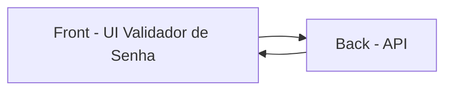

**Controle de Requisitos**

> Este arquivo é um controle para saber se todos os requisitos estão cumpridos. Foi escrito utilizando a IDE do Visual Studio Code. (Issue - Solution)

**Sobre o Sistema**

> Sistema pequeno de uma única entidade e sem relacionamentos, mas possui validação de formulário com regras customizadas.

> Projeto contruído como um projeto frontend Angular singular (sem micro frontend). Segue uma arquitetura em camadas com princípios de Orientação a Objetos, utilizando serviços, classes tipadas e SOLID principles, mas também incorpora programação reativa com RxJS.

> Organizado para facilitar manutenção e evolução:
> 
> - Camada de Apresentação: páginas e layout para composição da interface;
> - Camada de Lógica de Negócio: serviços para chamada de API e regras de validação;
> - Camada de Compartilhado: para controles reutilizaveis e regras de validação;
> - Camada de Infra: configurações que definem o sistema e os ambientes.
> - Camada de Testes: unitários e end-to-end para validar comportamento da aplicação.

**Desenvolvimento e Regras**

> Crie uma página web em que o usuário possa entrar com os campos nome, email e senha em um formulário e enviar esses dados para uma API especificada.
> - Solução: Resolvido com um componente de rota que contém um formulário em Signals. Os campos nome, email e senha não são dinâmicos, mas as regras podem ser manipuladas por campo.

**Validações de formulário**

> O campo Nome é obrigatório.
> O campo Email é obrigatório.
> - Solução: Foi aplicado direto no componente sem reuso de mensagem.

> O campo Email deve apenas permitir uma entrada com padrão de email.
> - Solução: Usado função nativa forms signals de email em vez de regex.

> O botão para submeter o formulário deve ficar desabilitado enquanto o mesmo estiver inválido, isto é, enquanto não há um nome, um email válido ou uma senha válida.
> - Solução: Resolvido com invalid().

> Todos os campos e botão devem ficar desabilitados enquanto estiver mandando o resultado para a api.
> - Solução: Regra disabled() implementada.

> As regras da validação de senha podem ser a qualquer momento modificadas, isto é, novas regras podem ser adicionadas e regras existentes podem ser removidas, portanto construa sua aplicação de uma forma que seja fácil fazer tais alterações no futuro.
> - Solução: As senhas podem ser alteradas sem afetar outra parte do sistema, apenas alterando o validationForm do componente. (Não implementei regras dinâmicas que se alteram 'a qualquer momento' durante o uso do usuário. Todas regras precisam ser alteradas, realizar build, deploy ..., teste)

> O projeto deve conter testes unitários. Você pode escolher o framework para desenvolvê-los de sua preferência.
> - Solução: Cada componente está com teste seu próprio teste e nele contem ao menos um teste de existencia.

> O projeto deve usar TypeScript ou ECMA 6+.
> - Solução: O Angular já inclui typescript por padrão. Resolvido com ng new ValidationUsingAPI.

> Forneça um passo a passo de como rodar sua aplicação, por exemplo, um arquivo README.md na raiz do projeto.
> Forneça uma breve descrição da solução utilizada.
> - Solução: O arquivo README.md dentro da pasta ValidationUsingAPI, foi atualizado.

> Validar se uma senha fornecida pelo usuário é válida.
> - Solução: Implementado usando a validação de formulário do signal forms. Cada regra tem sua própria função de validação, facilitando remover uma e colocar outra, pois não estão diretamente conectadas entre si.

> Senha Válida: Poderá submeter o formulário. (POST)
> - Solução: Implementado, o invalid() considera todas as regras com valores atualizados para poder submeter o formulário.

> Senha Inválida: Informar o usuário quais regras foram violadas. (Lista)
> - Solução: A visualização das regras está dinâmica e listando todas simultaneamente.

Opcional

> A página ser responsiva. Sua aparência é diferente numa resolução de celular.
> - Solução: Tratando-se de um sistema pequeno, onde não há menu lateral, barra de navegação, a responsividade foi colocada diretamente no arquivo de estilo da funcionalidade de validação de senha.

> Uso de pré-processador de CSS ou CSS Funcional.
> - Solução: Resolvido. Projeto iniado com sass via opções, mas convertido para SCSS no angular.json. Todos componentes em SCSS, permitindo identação..

> Testes End to End.
> - Solução: Configurado para Cypress. Cypress executou com sucesso o teste de abertura do sistema e encontrar o título visível. O teste de sucesso com preenchimento dos campos também foi bem sucedido. Criei o mesmo teste, modo individual do componente e passou.

Proposta verbal (Não descrito nas intruções)

> O sistema deve ser feito em inglês (Acredito que só por background, pois as imagens estão com todo visual em português)
> - Solução: Revisado. Todas as propriedades estão em padrão camelCase utilizando linguagem norte americana.

> Evitar utilizar IA e se utilizar, deixar documentado o que ela fez.
> - Solução: Resolvido. Sem usar. Porém o Pull Request do Github irá emitir uma solicitação padrão de review que utilizará o Copilot para revisar o código. Este review irei utilizar para resolver como se fossem débitos ténicos.

**Validar**

> Senhas são números com 6 dígitos.
> - Solução: Utilizado regex pattern de início e fim: ^[0-9]{6}$

> A senha deve estar entre 184759-856920.
> - Solução: Resolvido com min() e max() com regra customizada. (Menor Senha: x > 184759. Maior Senha: x < 856920)

> Dois dígitos adjacentes devem ser iguais (como 22 em 122346)
> - Solução: Resolvido com um validate() customizado. Desacoplado por dependency injection, classe Validation em shared.

> Começando da esquerda para a direita, os dígitos devem apenas crescer em valor ou se manter (como 111237 ou 135678).
> - Solução: Resolvido com um validate() customizado. Desacoplado por dependency injection, classe Validation em shared.

Testar Exemplos

> 222222 é válido (tem o dígito 2 repetido adjacente e nunca diminui em valor)
> - *Teste*: Passou. 

> 236775 não é válido (diminui o valor dos dígitos no trecho 75)
> - *Teste*: Passou.

> 135789 não é válido (não há duplicação de dígitos adjacentes)
> - *Teste*: Passou. Inclusive este número está abaixo do mínimo.

**Analise Resumida**
- Arquitetura da Solução.
- - Analise: (Em Camadas). Arquitetura de camadas com Apresentação, Lógica de Negócio, Compartilhado, Infra e Testes.

- Boas práticas de Orientação a Objetos.
- - Analise: (SOLID, DRY, KISS). SOLID: Pode se ver na possibilidade de reutilizar o serviço password-validation.ts ou criar outro serviço similar que extendem de ApiService, ou seja, há uma separação clara de responsabilidades. DRY: O Control Flow do Angular é um exelente exemplo de reuso de código no @for, mas não criei 'complexidade' com alto uso do DRY e a classe Validation também é um bom exemplo de possibilidade de replicar sem se repetir.

- Padrões de Projeto.
- - Analise: (camelCase, kbab-case e internacional). Todas variáveis e métodos em inglês e camelCase. Todas as classes e nomes de arquivos em kebab-case. Herança de classes com comentário superficiais e possibilidade de migrar para esqueleto abstrato. 

- Organização.
- - Analise: (Orientado a Serviço, Control Flow). A organização deste sistema está distribuida em Rotas, Layouts, Pages, Services, Compatilhado (Shared). Manutenção é simples, pois os componentes estão separados.

- Arquitetura CSS (BEM, SMACSS, ITCSS ou qual você desejar).
- - Analise: BEM. Modo auto-suficiente por componente, e genéricos no styles.scss. Um Reset.css é injetado também no angular para remover as pré-definições do navegador. Padrão das classes kbab-case.

- Funcionamento e apresentação geral da UI/UX.
- - Analise: (Responsivo, Roteável, Dinâmico, **Customizável**, Reutilizável). O layout é simplificado, centralizado, um header, que está no papel de toolbar. A tela se apresenta da mesma forma que as imagens, com algumas diferenças de estilo. Foi implementado a mecânica de claro e escuro, a de tema para trocar a cor principal do sistema, os icones para ajudar na auto descrição da ação, alguns efeitos de transição e movimento de carregamento, responsividade para três tamanhos de tela, sendo desktop, tablet e mobile.

**Gráfico da Arquitetura de comunicação**

**Arquitetura Física**

📦src

 ┣ 📂app

 ┃ ┣ 📂layout

 ┃ ┃ ┗ 📂master-layout

 ┃ ┃ ┃ ┣ 📜master-layout.html

 ┃ ┃ ┃ ┣ 📜master-layout.scss

 ┃ ┃ ┃ ┣ 📜master-layout.spec.ts

 ┃ ┃ ┃ ┗ 📜master-layout.ts

 ┃ ┣ 📂Pages

 ┃ ┃ ┗ 📂validation-form

 ┃ ┃ ┃ ┣ 📜validation-form.html

 ┃ ┃ ┃ ┣ 📜validation-form.scss

 ┃ ┃ ┃ ┣ 📜validation-form.spec.ts

 ┃ ┃ ┃ ┗ 📜validation-form.ts

 ┃ ┣ 📂services

 ┃ ┃ ┣ 📂base

 ┃ ┃ ┃ ┣ 📜api-service.spec.ts

 ┃ ┃ ┃ ┣ 📜api-service.ts

 ┃ ┃ ┃ ┗ 📜api-service.types.ts

 ┃ ┃ ┣ 📂password-validation

 ┃ ┃ ┃ ┣ 📜password-validation.spec.ts

 ┃ ┃ ┃ ┣ 📜password-validation.ts

 ┃ ┃ ┃ ┗ 📜validation-form.types.ts

 ┃ ┃ ┗ 📂ui

 ┃ ┃ ┃ ┣ 📜ui-controls.spec.ts

 ┃ ┃ ┃ ┣ 📜ui-controls.ts

 ┃ ┃ ┃ ┗ 📜ui.types.ts

 ┃ ┣ 📂shared

 ┃ ┃ ┣ 📂control-dark-light

 ┃ ┃ ┃ ┣ 📜control-dark-light.html

 ┃ ┃ ┃ ┣ 📜control-dark-light.scss

 ┃ ┃ ┃ ┣ 📜control-dark-light.spec.ts

 ┃ ┃ ┃ ┗ 📜control-dark-light.ts

 ┃ ┃ ┣ 📂control-hue

 ┃ ┃ ┃ ┣ 📜control-hue.html

 ┃ ┃ ┃ ┣ 📜control-hue.scss

 ┃ ┃ ┃ ┣ 📜control-hue.spec.ts

 ┃ ┃ ┃ ┗ 📜control-hue.ts

 ┃ ┃ ┗ 📂validation

 ┃ ┃ ┃ ┗ 📜validation.ts

 ┃ ┣ 📜app.config.ts

 ┃ ┣ 📜app.routes.ts

 ┃ ┣ 📜app.spec.ts

 ┃ ┗ 📜app.ts

 ┣ 📂env

 ┃ ┣ 📂development

 ┃ ┃ ┗ 📜env.ts

 ┃ ┣ 📂production

 ┃ ┃ ┗ 📜env.ts

 ┃ ┣ 📜env.ts

 ┃ ┗ 📜env.types.ts

 ┣ 📜index.html

 ┣ 📜main.ts

 ┗ 📜styles.scss

📦cypress

 ┣ 📂e2e

 ┃ ┗ 📜spec.cy.ts

 ┣ 📂fixtures

 ┃ ┗ 📜example.json

 ┣ 📂support

 ┃ ┣ 📜commands.ts

 ┃ ┣ 📜component-index.html

 ┃ ┣ 📜component.ts

 ┃ ┗ 📜e2e.ts

 ┣ 📜tsconfig.json

 ┗ 📜ValidationForm.cy.ts

📦public

 ┣ 📂css

 ┃ ┗ 📜reset.css

 ┗ 📜favicon.ico
 